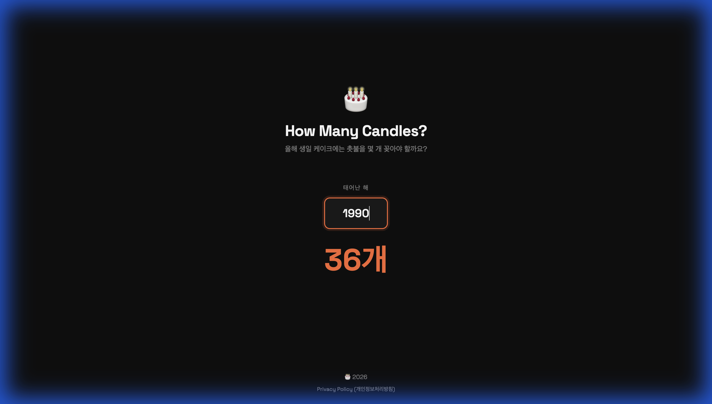

# 🎂 생일 촛불 계산기 (How Many Candles?)

생일 케이크에 촛불을 몇 개 꽂아야 하는지 고민이신가요?  
태어난 해만 입력하면 올해 생일에 필요한 촛불 개수를 즉시 계산해주는 심플하고 위트 있는 앱입니다.

 
## ✨ 주요 기능
- **심플한 디자인**: 불필요한 요소는 빼고, 핵심 정보(개수)만 깔끔하게 보여줍니다.
- **다크 모드 지원**: 눈이 편안한 다크 테마와 매력적인 타이포그래피를 제공합니다.
- **반응형 웹**: 모바일과 데스크탑 어디서든 완벽하게 보입니다.

## 🚀 사용방법
1. 사이트 접속: [yoongahee.com/how-many-candles](https://yoongahee.com/how-many-candles)
2. '태어난 해를 입력해주세요' 칸에 본인의 출생 연도(예: 1990)를 입력합니다.
3. 화면 중앙에 나타나는 촛불 개수를 확인합니다.

 
## 🛠 기술 스택
- **HTML5 / Vanilla JS**
- **CSS3 (Flexbox/Grid)**
- **Google Fonts (Space Grotesk)**
- **GitHub Pages (Deployment)**
- **Antigravity**

 
---
© 2026 Made with 💖 for birthday celebrations.
